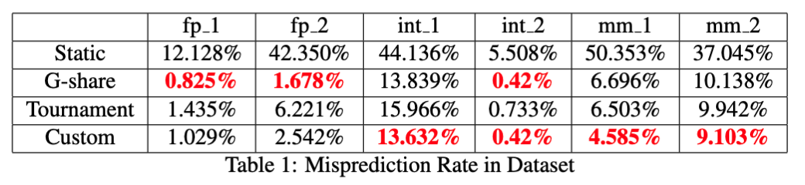

# CSE240A Branch Predictor Project

## Table of Contents
  * [Introduction](#introduction)
  * [Traces](#traces)
  * [Result](#results)
  * [Running your predictor](#running-your-predictor)
  * [Implementing the predictors](#implementing-the-predictors)
    - [Gshare](#gshare)
    - [Tournament](#tournament)
    - [Custom](#custom)
    - [Things to note](#things-to-note)


## Introduction

As we’ve discussed in class, branch prediction is critical to performance in modern processors.  An accurate branch predictor ensures that the front-end of the machine is capable of feeding the back-end with correct-path instructions. Beyond its criticality in processor execution, branch prediction is an interesting problem.  How do you make accurate predictions on little data using small, fast hardware structures.

For this Project you will be implementing various branch predictors in a simulated environment.  We have provided a starting framework to help you design your predictors.  The framework (main.c) will perform all of the command-line switches as well as the reading in of the trace files.  You will implement your predictors by completing all of the TODOs in the predictor.c file.  Note that this is the only file in which you are able to make changes, as it will be the only file of yours we use for grading.

## Traces

These predictors will make predictions based on traces of real programs.  Each line in the trace file contains the address of a branch in hex as well as its outcome (Not Taken = 0, Taken = 1):

```
<Address> <Outcome>
Sample Trace from int_1:

0x40d7f9 0
0x40d81e 1
0x40d7f9 1
0x40d81e 0
```

We provide test traces to you to aid in testing your project but we strongly suggest that you create your own custom traces to use for debugging.

## Result



The custom predictor outperforms G-share and Tournament generally. Somebody told me using perceptron only could be better but I'm tired.

## Running your predictor

In order to build your predictor you simply need to run `make` in the src/ directory of the project.  You can then run the program on an uncompressed trace as follows:   

`./predictor <options> [<trace>]`

If no trace file is provided then the predictor will read in input from STDIN. Some of the traces we provided are rather large when uncompressed so we have distributed them compressed with bzip2 (included in the Docker image).  If you want to run your predictor on a compressed trace, then you can do so by doing the following:

`bunzip2 -kc trace.bz2 | ./predictor <options>`

In either case the `<options>` that can be used to change the type of predictor
being run are as follows:

```
  --help       Print usage message
  --verbose    Outputs all predictions made by your
               mechanism. Will be used for correctness
               grading.
  --<type>     Branch prediction scheme. Available
               types are:
        static
        gshare:<# ghistory>
        tournament:<# ghistory>:<# lhistory>:<# index>
        custom
```
An example of running a gshare predictor with 10 bits of history would be:   

`bunzip2 -kc ../traces/int1_bz2 | ./predictor --gshare:10`

#### Gshare

```
Configuration:
    ghistoryBits    // Indicates the length of Global History kept
```
The Gshare predictor is characterized by XORing the global history register with the lower bits (same length as the global history) of the branch's address.

#### Tournament
```
Configuration:
    ghistoryBits    // Indicates the length of Global History kept
    lhistoryBits    // Indicates the length of Local History kept in the PHT
    pcIndexBits     // Indicates the number of bits used to index the PHT
```

Tournament Predictor popularized by the Alpha 21264 implemented. 

#### Custom

```
Configuration:
    ghistoryBits    // Indicates the length of Global History kept
    lhistoryBits    // Indicates the length of Local History kept in the PHT
    pcIndexBits     // Indicates the number of bits used to index the PHT
```

Our custom predictor uses a perceptron as choice predictor. Refer to the project report for more information.

#### Things to note

All history should be initialized to NOTTAKEN.  History registers should be updated by shifting in new history to the least significant bit position.
```
Ex. 4 bits of history, outcome of next branch is NT
  T NT T NT   <<  NT
  Result: NT T NT NT
```
```
All 2-bit predictors should be initialized to WN (Weakly Not Taken).
They should also have the following state transitions:

        NT      NT      NT
      ----->  ----->  ----->
    ST      WT      WN      SN
      <-----  <-----  <-----
        T       T       T
```

The Choice Predictor used to select which predictor to use in the Alpha 21264 Tournament predictor should be initialized to Weakly select the Global Predictor.


